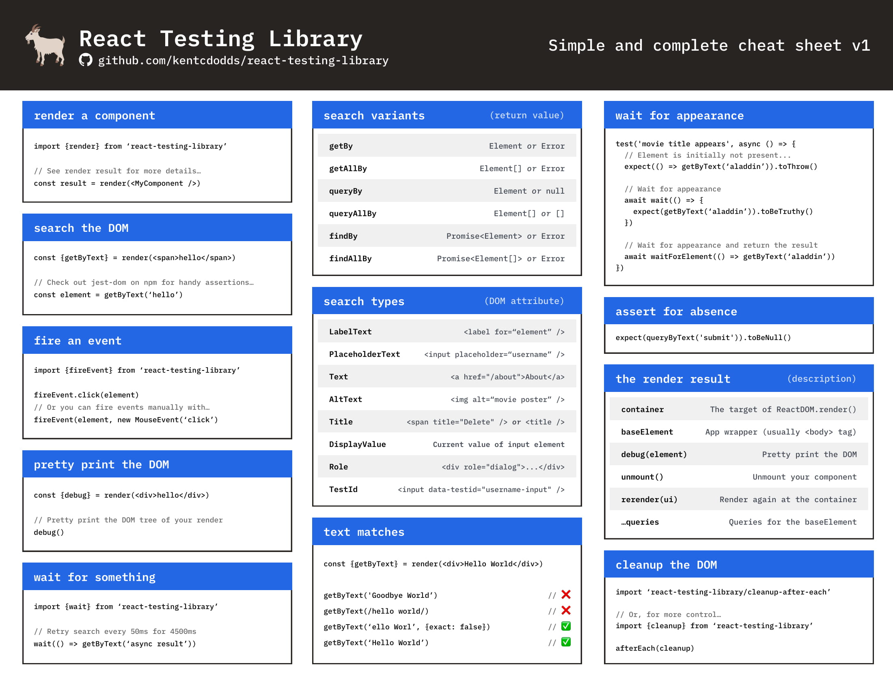

# Automated Testing

## React Testing Library


```bash
npm install --save-dev @testing-library/react
```

[React Testing Library GitHub](https://github.com/testing-library/react-testing-library)

The `react-testing-library` is a very light-weight solution for testing React components. It provides light utility functions on top of `react-dom` and `react-dom/test-utils`, in a way that encourages better testing practices. It's primary guiding principle is:

> The more your tests resemble the way your software is used, the more confidence they can give you.

### What this library is not

1. A test runner or framework
2. Specific to a testing framework (though we recommend Jest as our preference, the library works with any framework, and even in codesandbox!)

[What is React Testing Library Video](https://github.com/facebook/jest/raw/master/website/static/img/jest-readme-headline.png)

[Writing Better Test Results - Time to React - December 2019](https://www.youtube.com/watch?v=O0VxvRqgm7g&t=199s)

[DOM Testing Library Cheatsheet](https://testing-library.com/docs/dom-testing-library/cheatsheet)



## Jest


[Jest GitHub](https://github.com/facebook/jest)

:black_joker: Delightful JavaScript Testing

👩🏻‍💻 **Developer Ready**: Complete and ready to set-up JavaScript testing solution. Works out of the box for any React project.

:runner: **Instant Feedback**: Failed tests run first. Fast interactive mode can switch between running all tests or only test files related to changed files.

:camera: **Snapshot Testing**: Jest can capture snapshots of React trees or other serializable values to simplify UI testing.

### Installation

Install via `yarn`

```bash
yarn add --dev jest
```

Install via `npm`

```bash
npm install --save-dev jest
```

[Jest Cheatsheet](https://devhints.io/jest)

## Cypress


[Cypress GitHub](https://github.com/cypress-io/cypress)

[Cypress in a Nutshell - Video](https://www.youtube.com/watch?v=LcGHiFnBh3Y)

`Cypress` is a next generation front end testing tool built for the modern web. We address the key pain points developers and QA engineers face when testing modern applications.

Cypress make it possible to:

- Set up tests
- Write tests
- Run tests
- Debug Tests

### Who uses Cypress

Our users are typically developers or QA engineers building web applications using modern JavaScript frameworks.

Cypress enables you to write all types of tests:

- End-to-end tests
- Integration tests
- Unit tests

### Installation

Install via `npm`

```bash
npm install cypress --save-dev
```

Install via `yarn`

```bash
yarn add cypress --dev
```
